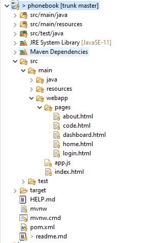

# Integration of AngularJS UI with a Sample Springboot Application

The initial springboot project is created using https://start.spring.io/

The springboot project has to define the web dependency for the webpages to work

Following steps were used in order to provide an angularjs interface


## Project Structure:


1.	Add a folder named webapp, that results in the following path from project root

```

	src/main/webapp
```

2.	Add the following files in the path    
	a. [pages](src/main/webapp/pages/) directory(contains all the html pages)   
	b. [app.js](src/main/webapp/app.js)  
	c. [index.html](src/main/webapp/index.html)   
	

```

	+--src
		|
		+--main
		|
		+--webapp
			|
			+---pages
			|	|
			|	+-->about.html
			|	+-->dashboard.html
			|	+-->home.html
			|	+-->login.html
			|		
			+-->app.js
			+-->index.html
			


```


3. Add the angular dependency as given below in the index.html

```

	<script	src="https://ajax.googleapis.com/ajax/libs/angularjs/1.6.9/angular.min.js">
	</script>

```

	
4. Add the angular dependency for routes. This will help provide route based navigation to different webpages
	
```

	<script src="https://ajax.googleapis.com/ajax/libs/angularjs/1.6.9/angular-route.min.js">
	</script>	
	
```

5. Add the path to app.js scripts in index.html

```

	<script src="app.js"></script>

```

6. Modify [app.js](src/main/webapp/app.js) to declare the following

	a. Declare the angularjs app name in app.js
	
	```
	
	var app = angular.module('phonebookApp',['ngRoute'])
	
	```
	
	b. Add Controller to handle the on-load or event based action
	(Sample given below).   
	Here callUpperCase function is added to handle the onclick event declared in [code.html](src/main/webapp/pages/code.html)
	
	```
	
	app.controller('CaseController', function($scope, $http){
	$scope.upperCaseText='in ng-controller : CaseController';
	
	$scope.callUpperCase = function(){
		console.log("Onclick :: callUpperCase :: called ");
		$http({
			method: "POST",
			url: "/toUpperCase",
			headers: {
				'Content-Type': 'application/json'
			},
			data: {'guestName' : $scope.guestName }
		}).then(
			function (response){
				$scope.upperCaseText=response.data.responseData;
				//location.href="#!/home";
			},
			function (response){
				console.log('Error occurred ')
			}		
		);
	}
	})
	
	```
	
7. To add navigation to other pages, add the routes using angularjs routes config 

```

app.config(function($routeProvider){
	//console.log("inside :: config called")
	$routeProvider
		.when('/login',{
			templateUrl : 'pages/login.html',
			controller : 'RouteController'
		})
		.when('/',{
			templateUrl : 'pages/home.html',
			controller : 'RouteController'
		})
		.when('/home',{
			templateUrl : 'pages/home.html',
			controller : 'RouteController'
		})
		.when('/dashboard',{
			templateUrl : 'pages/dashboard.html',
			controller : 'RouteController'
		})
		.when('/about',{
			templateUrl : 'pages/about.html',
			controller : 'RouteController'
		})
		.when('/code',{
			templateUrl : 'pages/code.html',
			controller : 'RouteController'
		})
		.otherwise({redirectTo: '/'});
});


```


	
	
	
	
